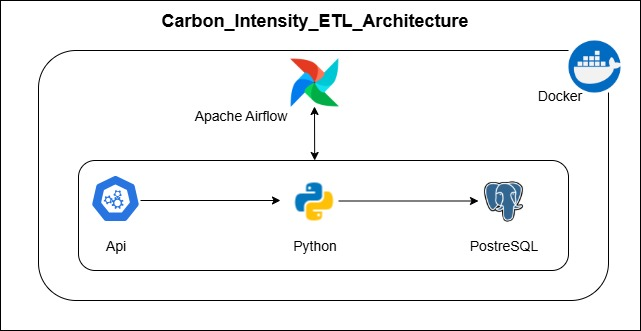

# Carbon Intensity ETL
This dockerised project leverages on the orchestrating power of airflow to seemlessly extract data from an Api at scheduled intervals

#Business Case (Xtd Research labs)
Xtd Research Labs is dedicated to pushing the boundaries of scientific knowledge and making a positive impact in the world. Through  research, collaborations, and community engagement, they strive to create a healthier, more sustainable future for all.

# Problem Statement
Xtd Research Labs needs an orchestrated data pipeline to ingest and process historical carbon intensity data for the United Kingdom, enabling analysis of trends and patterns in electricity generation. The pipeline should be capable of running on_prem and in the cloud by using docker and containers.  With this the company can conduct timely and continuous research on the environmental impact of energy sources.

## Rationale for the Project
Having a dockerised orchestrated pipeline will dramatically improve the efficiency, reliability, and scalability of Xtd Research Labs' environmental impact research. By eliminating manual data handling, the lab can minimize errors, accelerate data processing, and enable more frequent and comprehensive analysis.

## Aim of the Project
  * Develope a system to automatically retrieve historical carbon intensity data from the Carbon Intensity API.
  * Store the data in a structured format for analysis and reporting.
  * Automate the data pipeline for historical carbon intensity data in the UK
  * Implement robust error handling, monitoring, and logging mechanisms.
  * Dockerise the appliction

## Tech Stack
  * Postgres
  * Python
  * Airflow
  * Docker

## Project architecture

## Project Workflow
  * Data Extraction: Used Python codes to extract historical carbon intensity data from https://api.carbonintensity.org.uk/intensity.
  * Data Transformation: Used pandas to parse and manipulate the data for storage compatibility.
  * Data Storage: Designed a database schema to organize the data effectively and store with help of sql queries.
